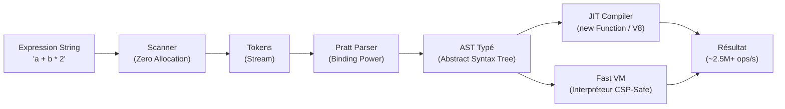

# Introduction

**SmartCal** is a modern TypeScript/JavaScript library designed for dynamic, secure, and ultra-high-performance evaluation of mathematical and logical expressions.

## Why SmartCal?

Most mathematical expression evaluators in JavaScript suffer from several critical issues:
1. **Dangerous use of `eval()`**: Code injection vulnerabilities and prohibition in strict environments (CSP, Cloudflare Workers).
2. **Inefficient parsing pipelines**: *Shunting-Yard* algorithms poorly suited for complex ternary operators, slow intermediate conversions (global regex, `split(" ")`, token arrays reallocated on every calculation).
3. **Absence of true compilation**: Full re-parsing of the text string on every execution.

**SmartCal v1.1** definitively solves these problems with a cutting-edge compiler architecture:

---

## Key Features

- **Complete Arithmetic & Logical Operations**: `+`, `-`, `*`, `/`, `%`, `^` (right-associative), `>`, `<`, `>=`, `<=`, `==`, `!=`, `&&`, `||`, `? :`.
- **JIT Compiler**: Generation of native JavaScript code optimized for V8 / JavaScriptCore / SpiderMonkey.
- **Fast VM Interpreter (CSP-Safe)**: Automatic or forced fallback mode without any dynamic code generation.
- **Decision Trees & Nested Ternaries**: Unlimited depth support (`a ? b : c ? d : e`).
- **`f_*` Dependency Graphs**: Automatic sub-formula resolution with memoized topological sorting and cycle detection.
- **Full String & Unicode Support**: Non-ASCII variable names (e.g., `café`, `résultat`, `بيانات`) and string literals (`"John Doe"`).
- **Extensibility**: Extensible registry of mathematical functions (`sin`, `cos`, `sqrt`, `round`, etc.).
- **Full Backward Compatibility**: Compatible with the existing v1.0.14 API.
