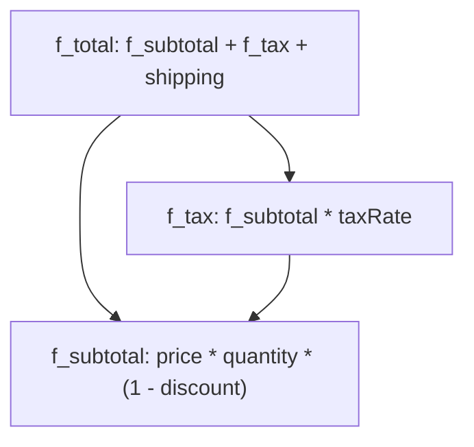

# Sub-Formulas & DAG Graphs (`f_*`)

SmartCal allows nesting precompiled formulas as variables of other formulas using the `f_*` prefix convention.

## The `f_*` Pattern

In complex applications (payroll engines, spreadsheets, billing), a final formula often depends on intermediate steps that are themselves formulas.

```typescript
import { compile } from 'smartcal';

// Sub-formula 1: Gross price with discount
const f_subtotal = compile('price * quantity * (1 - discountRate)');

// Sub-formula 2: Tax calculation on subtotal
const f_tax = compile('f_subtotal * taxRate');

// Final formula: Grand total with shipping
const f_total = compile('f_subtotal + f_tax + shipping');

// Evaluation
const result = f_total.evaluate({
  price: 50,
  quantity: 2,
  discountRate: 0.10,
  taxRate: 0.20,
  shipping: 5,
  f_subtotal,
  f_tax,
});

console.log(result); // 90 + 18 + 5 = 113
```

---

## Topological Resolution & Memoization

In previous versions, sub-formula evaluation recalculated each step recursively without caching, creating combinatorial explosion of computation times on deep graphs.

In **SmartCal v1.1**:
1. **Single-pass topological sorting**: The formula resolver automatically identifies the dependency order.
2. **Memoization**: Each sub-formula is evaluated **only once** per call.
3. **Cycle detection**: Circular dependencies are detected and raise a clear `FormulaResolutionError`.



---

## Circular Dependency Handling

If two formulas depend on each other, SmartCal intercepts the cycle before entering an infinite loop:

```typescript
import SmartCal, { compile } from 'smartcal';

const f_a = compile('f_b + 1');
const f_b = compile('f_a + 1');

// Throws FormulaResolutionError: Circular formula dependency detected: "f_a" depends on itself. (cycle: f_a → f_b → f_a)
SmartCal('f_a', { f_a, f_b });
```
