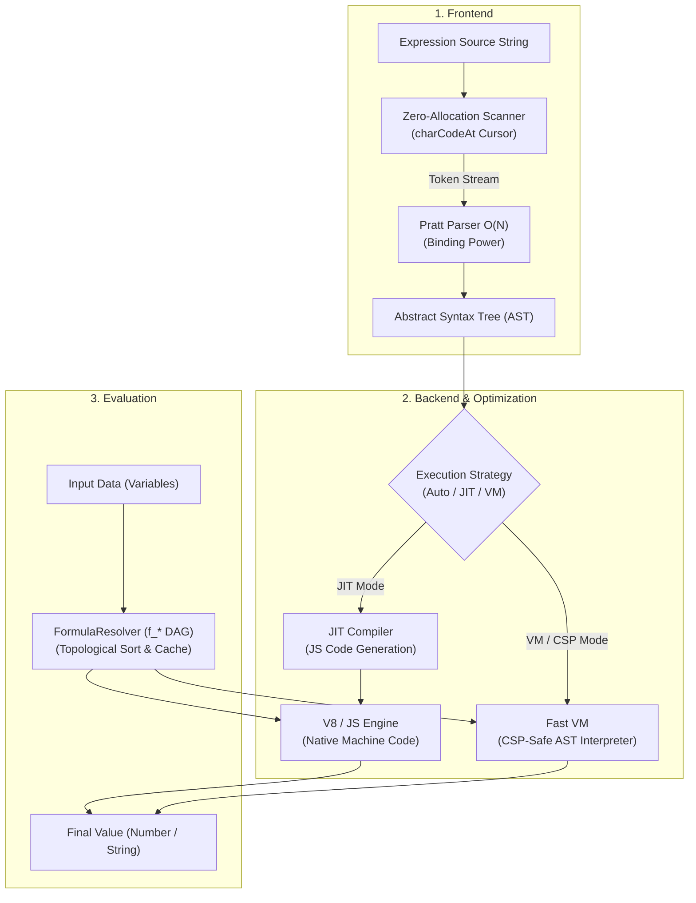

# Engine Architecture

SmartCal v1.1 is built on a complete 3-stage compilation pipeline: **Lexing $\rightarrow$ Parsing $\rightarrow$ Code Generation / Execution**.

---

## The 4 Optimization Pillars

1. **Zero-Allocation Scanner**:
   The scanner never splits the string with `.split(" ")` or global regular expressions. It traverses the string via a direct memory cursor using `charCodeAt()`.

2. **Linear Pratt Parser**:
   Unlike the traditional Shunting-Yard algorithm which struggles with nested ternaries and right-associative powers, the Pratt Parser analyzes the expression in a single clean recursive pass guided by *Binding Power*.

3. **JIT Code Generation**:
   In compiled mode, the AST is translated into pure JavaScript code (e.g., `return ((data['a'] || 0) + (data['b'] || 0) * 2)`), then compiled into a native function via `new Function()`. The V8 JavaScript engine can then optimize it via its TurboFan compiler.

4. **Topological Sub-Formula Resolution**:
   Nested formulas (`f_*`) are resolved in a single topological order with caching, eliminating the exponential degradation observed in v1.0.14.
