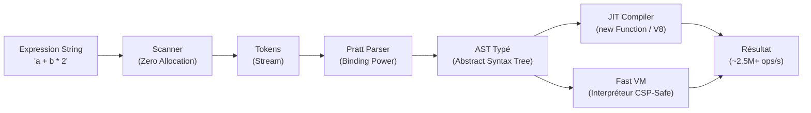

# Introduction

**SmartCal** est une bibliothèque TypeScript/JavaScript moderne conçue pour l'évaluation dynamique, sécurisée et ultra haute performance d'expressions mathématiques et logiques.

## Pourquoi SmartCal ?

La plupart des évaluateurs d'expressions mathématiques en JavaScript souffrent de plusieurs problèmes critiques :
1. **Utilisation dangereuse de `eval()`** : Failles d'injection de code et interdiction dans les environnements stricts (CSP, Cloudflare Workers).
2. **Pipelines de parsing inefficaces** : Algorithmes *Shunting-Yard* mal adaptés aux opérateurs ternaires complexes, conversions intermédiaires lentes (regex globales, `split(" ")`, tableaux de tokens réalloués à chaque calcul).
3. **Absence de vraie compilation** : Ré-analyse complète de la chaîne de texte à chaque exécution.

**SmartCal v1.1** résout définitivement ces problèmes grâce à une architecture de compilateur de pointe :

---

## Fonctionnalités Principales

- **Opérations Arithmétiques & Logiques Complètes** : `+`, `-`, `*`, `/`, `%`, `^` (associatif à droite), `>`, `<`, `>=`, `<=`, `==`, `!=`, `&&`, `||`, `? :`.
- **Compilateur JIT** : Génération de code JavaScript natif optimisé pour V8 / JavaScriptCore / SpiderMonkey.
- **Interpréteur Fast VM (CSP-Safe)** : Mode de secours automatique ou forcé sans aucune génération dynamique de code.
- **Arbres de Décision & Ternaires Imbriqués** : Support sans limite de profondeur (`a ? b : c ? d : e`).
- **Graphes de Dépendances `f_*`** : Résolution automatique des sous-formules avec tri topologique mémoïsé et détection de cycle.
- **Support des Chaînes avec Espaces & Unicode** : Variables en caractères non-ASCII (ex: `café`, `résultat`, `بيانات`) et littéraux chaînes (`"John Doe"`).
- **Extensibilité** : Registre extensible de fonctions mathématiques (`sin`, `cos`, `sqrt`, `round`, etc.).
- **Rétrocompatibilité Totale** : Compatible avec l'API existante v1.0.14.
