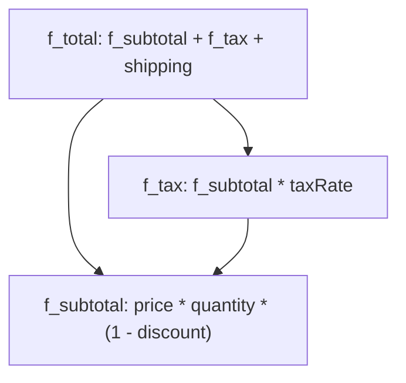

# Sous-Formules & Graphes DAG (`f_*`)

SmartCal permet d'imbriquer des formules précompilées comme variables d'autres formules grâce à la convention de préfixe `f_*`.

## Le Motif `f_*`

Dans des applications complexes (moteurs de paie, feuilles de calcul, facturation), une formule finale dépend souvent d'étapes intermédiaires qui sont elles-mêmes des formules.

```typescript
import { compile } from 'smartcal';

// Sous-formule 1 : Prix brut avec remise
const f_subtotal = compile('price * quantity * (1 - discountRate)');

// Sous-formule 2 : Calcul de la TVA sur le sous-total
const f_tax = compile('f_subtotal * taxRate');

// Formule finale : Total général avec frais de livraison
const f_total = compile('f_subtotal + f_tax + shipping');

// Évaluation
const result = f_total.evaluate({
  price: 50,
  quantity: 2,
  discountRate: 0.10,
  taxRate: 0.20,
  shipping: 5,
  f_subtotal,
  f_tax,
});

console.log(result); // 90 + 18 + 5 = 113
```

---

## Résolution Topologique & Mémoïsation

Dans les versions antérieures, l'évaluation des sous-formules recalculait chaque étape récursivement sans cache, ce qui créait une explosion combinatoire des temps de calcul sur des graphes profonds.

Dans **SmartCal v1.1** :
1. **Tri topologique à passage unique** : Le résolveur de formules identifie automatiquement l'ordre des dépendances.
2. **Mémoïsation** : Chaque sous-formule n'est évaluée **qu'une seule fois** par appel.
3. **Détection de cycles** : Les dépendances circulaires sont détectées et lèvent une exception claire `FormulaResolutionError`.



---

## Gestion des Dépendances Circulaires

Si deux formules dépendent mutuellement l'une de l'autre, SmartCal intercepte le cycle avant d'entrer dans une boucle infinie :

```typescript
import SmartCal, { compile } from 'smartcal';

const f_a = compile('f_b + 1');
const f_b = compile('f_a + 1');

// Lève FormulaResolutionError: Circular formula dependency detected: "f_a" depends on itself. (cycle: f_a → f_b → f_a)
SmartCal('f_a', { f_a, f_b });
```
