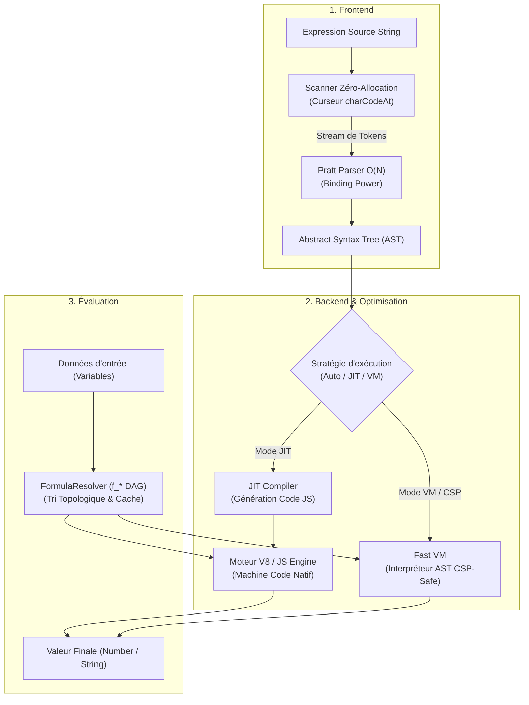

# Architecture du Moteur

SmartCal v1.1 repose sur un pipeline de compilation complet en 3 étapes : **Lexing $\rightarrow$ Parsing $\rightarrow$ Code Generation / Execution**.

---

## Les 4 Piliers d'Optimisation

1. **Scanner Zéro-Allocation** :
   Le scanner ne découpe jamais la chaîne avec `.split(" ")` ou des expressions régulières globales. Il parcourt la chaîne via un curseur mémoire direct avec `charCodeAt()`.

2. **Pratt Parser Linéaire** :
   Contrairement à l'algorithme Shunting-Yard traditionnel qui peine à gérer les ternaires imbriqués et les puissances associatives à droite, le Pratt Parser analyse l'expression en une seule passe récursive propre guidée par la force de liaison (*Binding Power*).

3. **JIT Code Generation** :
   En mode compilé, l'AST est traduit en une chaîne de code JavaScript pure (ex: `return ((data['a'] || 0) + (data['b'] || 0) * 2)`), puis compilé en fonction native via `new Function()`. Le moteur JavaScript V8 peut alors l'optimiser via son compilateur TurboFan.

4. **Résolution Topologique de Sous-Formules** :
   Les formules imbriquées (`f_*`) sont résolues en un seul ordre topologique avec mise en cache, supprimant la dégradation exponentielle observée dans la v1.0.14.
